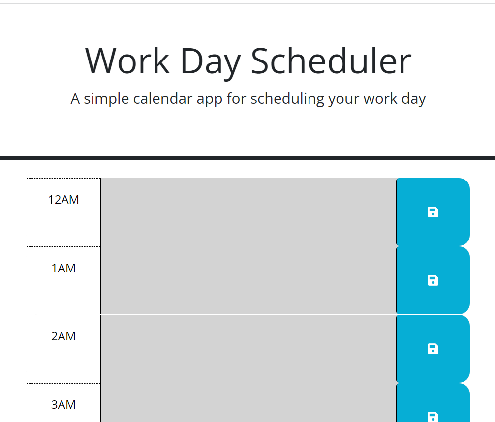

# 05 Third-Party APIs: Work Day Scheduler

## Description

A calendar application that allows a user to save events for each hour of the day. Also, the app will maintain users input info upon refresh.

## URL's

[github](https://github.com/Heathlington/H-Dill-Work-Day-Scheduler)

[live site](https://heathlington.github.io/H-Dill-Work-Day-Scheduler/ )

## Screenshot of Challenge

## Resource and Assistance Credit

Tutoring session assistance from Erik Hoversten
Classmate Assistance from Juan Martinez and Instructor Eric Sayer

